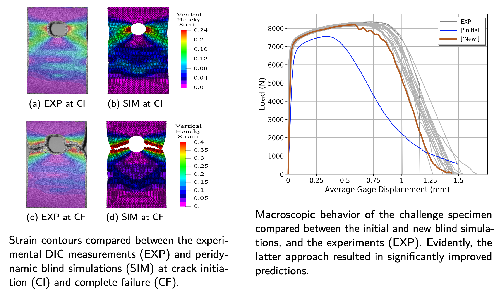

I consider the best of different numerical methods to build accurate, efficient, and robust predictive frameworks for tackling a variety of engineering challenges. My research involves usage and development of meshfree models (e.g. peridynamics), Galerkin methods (e.g. Isogeometric Analysis), and data-driven techniques (e.g. Neural Networks) for simulating the response of solid structures and fluid flows in extreme conditions (e.g. blast events).

## **Ductile Fracture Modeling with Peridynamics**

<figure>
  
</figure>
  

 
  The peridynamic theory (PD) has shown promising capabilities in handling material failure without any complicated numerical treatments at material discontinuities (e.g. cracks and fracture). PD has been widely applied to a broad range of challenging problems, mostly involving brittle fracture. However, its applications to predicting ductile fracture remains largely untested. The third Sandia Fracture Challenge (SFC3) was seen as an opportunity to assess the state of the art of the theory in predicting the response of an additively manufactured 316L stainless steel bar with a complex geometry under the dynamic tensile experiments performed by Sandia National Laboratories (SNL). The performance of a recently developed finite deformation PD model coupled with a ductile fracture theory was explored over this problem. An iterative inverse technique was applied to calibrate the model parameters using the longitudinal and notched tensile tests data provided by SNL. A blind prediction of the deformation and failure behavior of the SFC3 geometry was performed by embedding the calibrated formulation in a PD simulation. Uncertainty was introduced into the model parameters to quantify material variability. We observed that while the modeling approach led to qualitatively good results and a correctly predicted crack path, it underpredicted the load-carrying capacity of the structure and simulated an early fracture. Our post-experiment analysis identified material instability issues associated with the model as the primary sources of error. As a remedy, we proposed a bond-associated, semi-Lagrangian PD formulation that is stable under large inhomogeneous deformation. The new method was tested by revisiting the challenge problem in a blind-prediction approach. We obtained significantly improved predictions of ductile fracture phenomenon in this challenge using the new technique.

  **Selected Publications**

  -  <a href="https://link.springer.com/article/10.1007/s10704-020-00455-1">Revisiting the Third Sandia Fracture Challenge: A Bond-Associated, Semi-Lagrangian Peridynamic Approach to Modeling Large Deformation and Ductile Fracture</a>, <i>International Journal of Fracture</i>, 2020. 
  -  <a href="https://www.sciencedirect.com/science/article/pii/S0022509619309512">A Semi-Lagrangian Constitutive Correspondence Framework for Peridynamics</a>, <i>Journal of the Mechanics and Physics of Solids</i>, 2020. 
  -  <a href="https://www.sciencedirect.com/science/article/pii/S0020768319303506">On the Stability of the Generalized, Finite Deformation Correspondence Model of Peridynamics</a>, <i>International Journal of Solids and Structures</i>, 2020. 
  -  <a href="https://link.springer.com/article/10.1007/s10704-019-00361-1">The Third Sandia Fracture Challenge: Predictions of Ductile Fracture in Additively Manufactured Metal</a>, <i>International Journal of Fracture</i>, 2019. 
  -  <a href="https://link.springer.com/article/10.1007/s10704-019-00363-z">The Third Sandia Fracture Challenge: Peridynamic Blind Prediction of Ductile Fracture Characterization in Additively Manufactured Metal</a>, <i>International Journal of Fracture</i>, 2019. 

